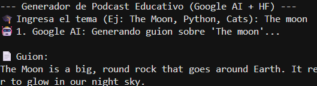
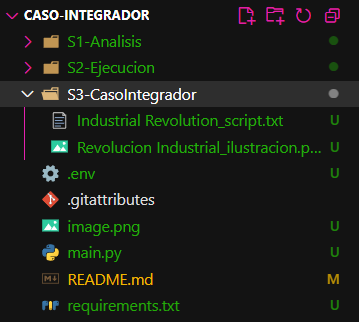

# Caso-Integrador
Caso-Integrador SGB LARO


# EduGen: Generador de Material Didáctico Multimedia (Caso Integrador)

## 1. Descripción del Problema Educativo
En la educación primaria, los docentes invierten una cantidad significativa de tiempo buscando o creando recursos visuales y narrativos adaptados a niños. A menudo, encuentran textos muy complejos o imágenes con derechos de autor que no pueden utilizar. El problema es la **falta de agilidad para personalizar contenido multimedia** específico para una clase.

## 2. Solución Propuesta
**EduGen** es un prototipo de software que automatiza la creación de material didáctico. A partir de un simple tema (ej: "La Fotosíntesis"), el sistema orquesta dos inteligencias artificiales para entregar:
1.  Una explicación textual adaptada pedagógicamente (Nivel primaria).
2.  Una narración en audio del texto explicativo para estudiantes con dificultades de lectura o para aprendizaje auditivo.

## 3. Arquitectura y Herramientas IA Utilizadas
Este proyecto integra dos plataformas clave del laboratorio para simular un flujo de trabajo de producción de contenido:

* **Google AI Studio (Modelo Gemini Pro):** Seleccionado por su capacidad de razonamiento y adaptación de tono. Se utiliza para generar el guion pedagógico, asegurando que el lenguaje sea apropiado para el público objetivo.
* **Hugging Face (Inference API - facebook/mms-tts-spa):** Utilizado para la síntesis de voz. Permite integrar capacidades de audio utilizando modelos Open Source alojados en la nube de HF.
* **Windsurf (IA apoyo para desarrollo de codigo):** Elegido por su velocidad y capacidad de generar documentacion de alta calidad. Se encarga del desarrollo y leginilidad del codigo.

## 4. Instrucciones de Ejecución
Para probar este prototipo:

1.  Clonar el repositorio y navegar a la carpeta `Caso_Integrador`.
2.  Instalar las dependencias:
    ```bash
    pip install -r requirements.txt
    ```
3.  Configurar las variables de entorno creando un archivo `.env` con las siguientes claves:
    * `GOOGLE_API_KEY`
    * `HUGGINGFACE_API_TOKEN`
4.  Ejecutar el script:
    ```bash
    python main.py
    ```
5.  Ingresar un tema cuando se solicite (ej: "La gravedad").
6.  Revisar la carpeta `S3-CasoIntegrador/` para ver los archivos generados.

## 5. Evidencias

